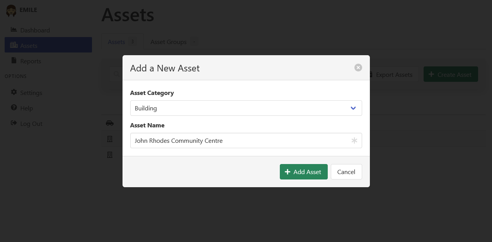

[Home](https://cityssm.github.io/EMILE/)
•
[Help](https://cityssm.github.io/EMILE/docs/)

# Assets

**Assets** describe any entity that consumes energy. Arenas, administrative buildings,
and parks are all assets that may consume multiple energy types,
like electricity, natural gas, and water. EMILE can track multiple energy types
on each of the assets it tracks.

**Asset Groups** are a way to group together assets for the purpose of reporting on them together.

## Adding Assets

Assets can be created manually,
or create automatically created when [new data is imported](dataSources.md) into EMILE.
Update users can manually create an asset by clicking the "Create Asset" button.

New assets need a category and a name.
Note that admin users can create new categories from the "Table Maintenance" section
under "Settings".
Additional fields become available after the asset is created.

## Merging Assets

When data is imported from multiple sources, it may result in more than one instance of the same asset.

Merging assets creates a new asset that:

- Maintains all of the aliases of the selected assets.
- Belongs to all the same asset groups as the selected assets.
- Includes the data from all selected assets.

Users with update permission can merge assets by selecting the checkboxes
at the beginning of each asset row.
Once two or more assets are selected, click the "Merge Assets" button.

Select the preferred asset category, name, and coordinates,
then click "Merge Assets".

When the process is complete, the asset update modal will appear
to further refine the newly merged asset.
