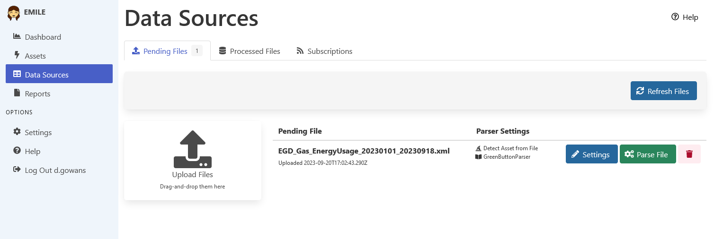

[Home](https://cityssm.github.io/EMILE/)
•
[Help](https://cityssm.github.io/EMILE/docs/)

# Data Sources

**Data Sources** are the places where energy data comes from.

Uploaded data files can be the following types.

- CSV files.
- Microsoft Excel files.
- [Green Button Download My Data® (DMD)](https://www.greenbuttonalliance.org/green-button-download-my-data-dmd) XML files.

Only files with defined parsers can be uploaded.
In the case of CSV and Excel files, those parsers are defined in EMILE's config file.

EMILE also has the ability to receive data automatically using the
[Green Button Connect My Data® (CMD)](https://www.greenbuttonalliance.org/green-button-connect-my-data-cmd) standard.

⭐ Note that before EMILE can connect to your utility's servers,
you need to go through a third party application registration process
with the utility. Each utility provider has a unique registration
process, but once registered, should function similarly.

Tested Green Button® CMD implementations include:

- [PUC Services provided through Utility API](https://greenbutton.ssmpuc.com/).

For more information on tested implementations, see the
[Green Button® Subscriber for Node repository](https://github.com/cityssm/node-green-button-subscriber).

## Trademarks

® GREEN BUTTON is a registered trademark owned by Departments of the U.S. Government.
