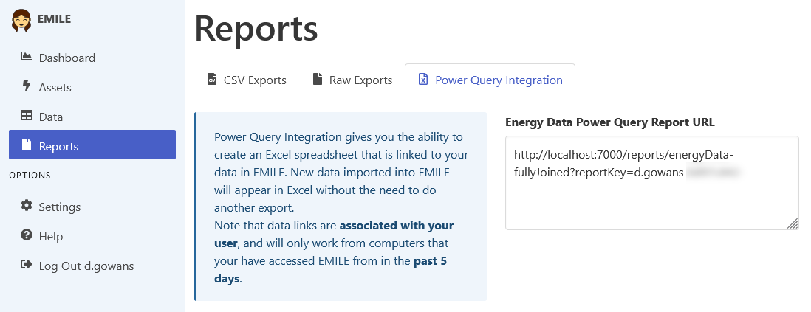
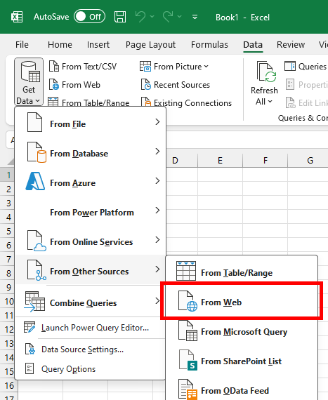
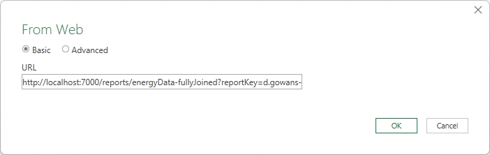
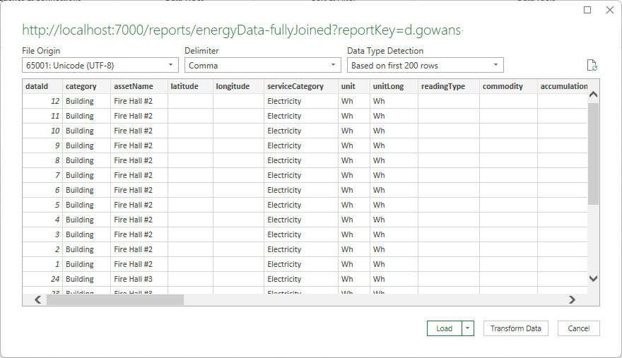

[Home](https://cityssm.github.io/EMILE/)
•
[Help](https://cityssm.github.io/EMILE/docs/)

# Reports

EMILE offers several reporting options on the Reports page.

- **Formatted CSV Exports** 
  These reports omit deleted records, join together tables, and remove key fields used behind the scenes.

- **Raw Exports** 
  These reports include data as it exists in the backend database. They may contain deleted records
  that have not been fully purged from the database.

- **Power Query Integrations** 
  These reports are set up to be linked to from third party tools like Microsoft Excel.
  Once linked, the tool will be able to refresh the exported data automatically.

## Connect EMILE to Microsoft Excel using Power Query

Power Query offers a way to maintain a connection to the EMILE data through Microsoft Excel
that can be refreshed automatically as new data is recorded.

To get started, log into EMILE, and navigate to the **Reports** section.

Visit the **Power Query Integration** tab.
Copy the **Report URL** to your clipboard.

Next, open **Microsoft Excel**.
Either create a new Workbook, or open an existing one that will be storing the data and the link to it.

Visit the **Data** ribbon.
In the **Get & Transform Data** section, select **Get Data**, **From Other Sources**, **From Web**.

Paste the **Report URL** in the **URL** field.

After pressing **OK**, you may need to agree to additional permissions.

Finish the process by clicking the **Load** button.

The data will be imported into an Excel spreadsheet.
Once imported, the data can be used as a data source for Pivot Tables, graphs, and more.

The data can be refreshed at any time from Excel using the **Refresh All** button on the **Data** ribbon.
