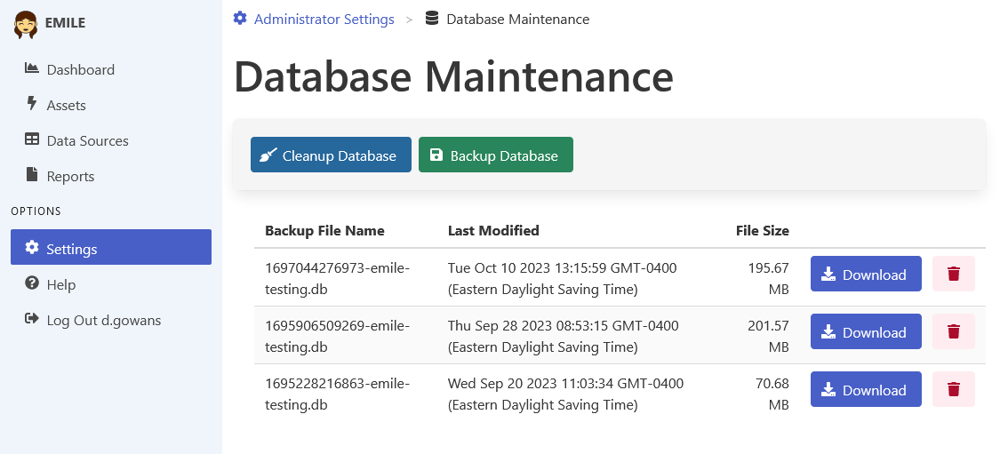

[Home](https://cityssm.github.io/EMILE/)
•
[Help](https://cityssm.github.io/EMILE/docs/)

# Settings - Database Maintenance

EMILE relies on a SQLite database to store its data. The Database Maintenance area
lets administrators make backups of that SQLite database, clean out previously deleted records,
and download backed up copies of the database for use in reporting applications that support SQLite.

## Related Downloads

Note that the download links below are for software not maintained by
the City of Sault Ste. Marie.

- [SQLite ODBC Driver](http://www.ch-werner.de/sqliteodbc/) - Allows tools like Microsoft Excel and Microsoft Power BI to connect to SQLite databases.
- [DB Browser of SQLite](https://sqlitebrowser.org/) - A cross platform tool for working with SQLite databases.
